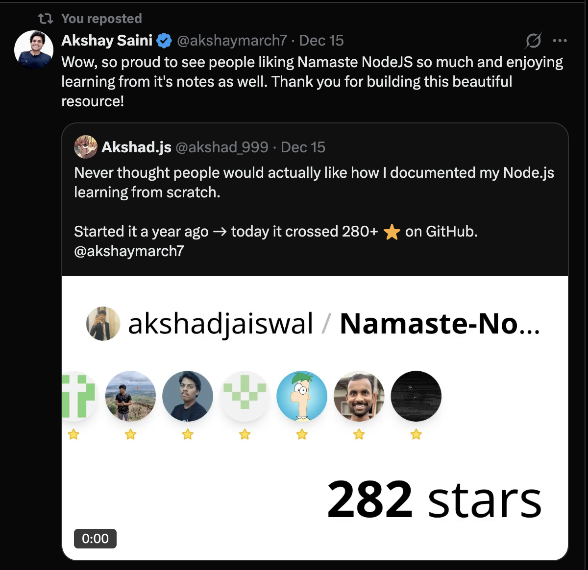

# Namaste Nodejs

🌟 Proud to share that [Akshay Saini](https://x.com/akshaymarch7), creator of the renowned Namaste JavaScript series and a leading voice in the JavaScript community, recognized this repository! His appreciation means a lot to the developer community learning Node.js.

## [Check live documentation to learn step by step](https://namaste-nodejs.vercel.app/)

##  🎨 Contents:

This repository contains a `Collection of Assignments & Class Notes`, which help you understand the concepts of Node.js.

## **Season 01:** 

## 📚 [_Chapter 01 - Introduction to NodeJs_](https://github.com/akshadjaiswal/Namaste-Nodejs/tree/main/Chapter%2001-%20Introduction%20to%20NodeJs)

- 📖 [_Theory_](https://github.com/akshadjaiswal/Namaste-Nodejs/blob/main/Chapter%2001-%20Introduction%20to%20NodeJs/README.md)

## 📚 [_Chapter 02 - JS on the Server_](https://github.com/akshadjaiswal/Namaste-Nodejs/tree/main/Chapter%2002%20JS%20on%20the%20Server)

- 📖 [_Theory_](https://github.com/akshadjaiswal/Namaste-Nodejs/tree/main/Chapter%2002%20JS%20on%20the%20Server#namaste-nodejs---episode-2-summary)

## 📚 [_Chapter 03 - Let's Write the code_](https://github.com/akshadjaiswal/Namaste-Nodejs/tree/main/Chapter%2003%20-%20Let's%20Write%20the%20code)

- 💻 [_Coding_](https://github.com/akshadjaiswal/Namaste-Nodejs/tree/main/Chapter%2003%20-%20Let's%20Write%20the%20code/Code)
- 📖 [_Theory_](https://github.com/akshadjaiswal/Namaste-Nodejs/tree/main/Chapter%2003%20-%20Let's%20Write%20the%20code#namaste-nodejs---episode-3-summary)

## 📚 [_Chapter 04 - module.export & require_](https://github.com/akshadjaiswal/Namaste-Nodejs/tree/main/hapter%2004%20-%20module.export%20%26%20require)

- 💻 [_Coding_](https://github.com/akshadjaiswal/Namaste-Nodejs/tree/main/Chapter%2004%20-%20module.export%20%26%20require/Code)
- 📖 [_Theory_](https://github.com/akshadjaiswal/Namaste-Nodejs/tree/main/Chapter%2004%20-%20module.export%20%26%20require#namaste-nodejs---episode-4-summary)

## 📚 [_Chapter 05 - Diving into NodeJs Repo_](https://github.com/akshadjaiswal/Namaste-Nodejs/tree/main/Chapter%2005%20-%20Diving%20in%20to%20NodeJS%20github%20repo)

- 💻 [_Coding_](https://github.com/akshadjaiswal/Namaste-Nodejs/tree/main/Chapter%2005%20-%20Diving%20in%20to%20NodeJS%20github%20repo/Code)
- 📖 [_Theory_](https://github.com/akshadjaiswal/Namaste-Nodejs/tree/mainChapter%2005%20-%20Diving%20in%20to%20NodeJS%20github%20repo#episode-05--diving-into-the-nodejs-github-repo)

## 📚 [_Chapter 06 - libuv & async IO_](https://github.com/akshadjaiswal/Namaste-Nodejs/tree/main/Chapter%2006%20-%20libuv%20%26%20async%20IO)

- 💻 [_Coding_](https://github.com/akshadjaiswal/Namaste-Nodejs/tree/main/Chapter%2006%20-%20libuv%20%26%20async%20IO/Code)
- 📖 [_Theory_](https://github.com/akshadjaiswal/Namaste-Nodejs/tree/main/Chapter%2006%20-%20libuv%20%26%20async%20IO#episode-06-libuv-and-async-io)

## 📚 [_Chapter 07 - sync, async, setTimeout Zero-Code_](https://github.com/akshadjaiswal/Namaste-Nodejs/tree/main/Chapter%2007%20-%20sync%20async%2C%20setTimeout%20Zero%20-%20Code)

- 💻 [_Coding_](https://github.com/akshadjaiswal/Namaste-Nodejs/tree/main/Chapter%2007%20-%20sync%20async%2C%20setTimeout%20Zero%20-%20Code/Code)
- 📖 [_Theory_](https://github.com/akshadjaiswal/Namaste-Nodejs/tree/main/Chapter%2007%20-%20sync%20async%2C%20setTimeout%20Zero%20-%20Code#understanding-nodejs-v8-libuv-and-file-operations)

## 📚 [_Chapter 08 -  Deep dive into v8 JS Engine_](https://github.com/akshadjaiswal/Namaste-Nodejs/tree/main/Chapter%2008%20-%20%20Deep%20dive%20into%20v8%20JS%20Engine)

- 📖 [_Theory_](https://github.com/akshadjaiswal/Namaste-Nodejs/tree/main/Chapter%2008%20-%20%20Deep%20dive%20into%20v8%20JS%20Engine#v8-javascript-engine-code-execution-phases)

## 📚 [_Chapter 09 - libuv and event loop_](https://github.com/akshadjaiswal/Namaste-Nodejs/tree/main/Chapter%2009%20-%20libuv%20%26%20event%20loop)

- 💻 [_Coding_](https://github.com/akshadjaiswal/Namaste-Nodejs/tree/main/Chapter%2009%20-%20libuv%20%26%20event%20loop/Code)
- 📖 [_Theory_](https://github.com/akshadjaiswal/Namaste-Nodejs/tree/main/Chapter%2009%20-%20libuv%20%26%20event%20loop#understanding-libuv-and-event-loop)

## 📚 [_Chapter 10 - Thread pool in libuv_](https://github.com/akshadjaiswal/Namaste-Nodejs/tree/main/Chapter%2009%20-%20libuv%20%26%20event%20loop)

- 💻 [_Coding_](https://github.com/akshadjaiswal/Namaste-Nodejs/tree/main/Chapter%2010%20-%20Thread%20Pool%20in%20libuv/Code)
- 📖 [_Theory_](https://github.com/akshadjaiswal/Namaste-Nodejs/tree/main/Chapter%2010%20-%20Thread%20Pool%20in%20libuv)

## 📚 [_Chapter 11 - Creating the Server_](https://github.com/akshadjaiswal/Namaste-Nodejs/tree/main/Chapter%2011%20-%20Creating%20the%20Server)

- 💻 [_Coding_](https://github.com/akshadjaiswal/Namaste-Nodejs/tree/main/Chapter%2011%20-%20Creating%20the%20Server/Code)
- 📖 [_Theory_](https://github.com/akshadjaiswal/Namaste-Nodejs/tree/main/Chapter%2011%20-%20Creating%20the%20Server#creating-a-server)

## 📚 [_Chapter 12 - Databases SQL and NoSQL_](https://github.com/akshadjaiswal/Namaste-Nodejs/tree/main/Chapter%2012%20-%20Databases%20%20SQL%20and%20NoSQL)

- 📖 [_Theory_](https://github.com/akshadjaiswal/Namaste-Nodejs/tree/main/Chapter%2012%20-%20Databases%20%20SQL%20and%20NoSQL#creating-a-server-databases---sql--nosql)

## 📚 [_Chapter 13 - Creating a database & mongodb_](https://github.com/akshadjaiswal/Namaste-Nodejs/tree/main/Chapter%2013%20-%20Creating%20a%20database%20%26%20mongodb)

- 💻 [_Coding_](https://github.com/akshadjaiswal/Namaste-Nodejs/tree/main/Chapter%2013%20-%20Creating%20a%20database%20%26%20mongodb/Code)
- 📖 [_Theory_](https://github.com/akshadjaiswal/Namaste-Nodejs/tree/main/Chapter%2013%20-%20Creating%20a%20database%20%26%20mongodb#creating-a-database--mongodb)

##  **Season 2:**

## Working on **`devTinder`** app

DevTinder is a MERN (MongoDB, Express, React, Node.js) application designed to help developers connect and collaborate. The project uses a microservices architecture, which divides the application into two main services:

**[Repository - Backend](https://github.com/akshadjaiswal/devTinder-backend)** 
View [`commits`](https://github.com/akshadjaiswal/devTinder-backend/commits/main/) for every topic update

**[Repository - Frontend](https://github.com/akshadjaiswal/devTinder-frontend)** 
View [`commits`](https://github.com/akshadjaiswal/devTinder-frontend/commits/main/) for every topic update

1. **Frontend**: Handles the user interface and client-side logic.
2. **Backend**: Manages server-side logic, APIs, and interactions with the database.

## 📚 [_Chapter 01 - Microservices vs Monolith - How to build a Project_](https://github.com/akshadjaiswal/Namaste-Nodejs/tree/main/Chapter%20S2%2001%20Microservices%20vs%20Monolith%20-%20How%20to%20build%20a%20project)

- 📖 [_Theory_](https://github.com/akshadjaiswal/Namaste-Nodejs/tree/main/Chapter%20S2%2001%20Microservices%20vs%20Monolith%20-%20How%20to%20build%20a%20project/README.md)

## 📚 [_Chapter 02 - Features HLD LLD and Planning_](https://github.com/akshadjaiswal/Namaste-Nodejs/tree/main/Chapter%20S2%2002%20Features%2C%20HLD%20%20LLD%20and%20Planning)

- 📖 [_Theory_](https://github.com/akshadjaiswal/Namaste-Nodejs/tree/main/Chapter%20S2%2002%20Features%2C%20HLD%20%20LLD%20and%20Planning/README.md)

## 📚 [_Chapter 03 - Creating Our Express Server_](https://github.com/akshadjaiswal/Namaste-Nodejs/tree/main/Chapter%20S2%2003%20Creating%20our%20Express%20server)

- 📖 [_Theory_](https://github.com/akshadjaiswal/Namaste-Nodejs/tree/main/Chapter%20S2%2003%20Creating%20our%20Express%20server/README.md)

## 📚 [_Chapter 04 - Routing and Request Handlers_](https://github.com/akshadjaiswal/Namaste-Nodejs/tree/main/Chapter%20S2%2004%20Routing%20and%20Request%20handlers)

- 📖 [_Theory_](https://github.com/akshadjaiswal/Namaste-Nodejs/tree/main//Chapter%20S2%2004%20Routing%20and%20Request%20handlers/README.md)

## 📚 [_Chapter 05 - Middlewares and Error Handlers_](https://github.com/akshadjaiswal/Namaste-Nodejs/tree/main/Chapter%20S2%2005%20Middlewares%20and%20Error%20Handlers)

- 📖 [_Theory_](https://github.com/akshadjaiswal/Namaste-Nodejs/tree/main/Chapter%20S2%2005%20Middlewares%20and%20Error%20Handlers/README.md)

## 📚 [_Chapter 06 - Database Schema Models and Mongoose_](https://github.com/akshadjaiswal/Namaste-Nodejs/tree/main/Chapter%20S2%2006%20Database%2C%20Schema%2C%20Models%20%26%20Mongoose)

- 📖 [_Theory_](https://github.com/akshadjaiswal/Namaste-Nodejs/tree/main/Chapter%20S2%2006%20Database%2C%20Schema%2C%20Models%20%26%20Mongoose/README.md)

## 📚 [_Chapter 07 - Diving into APIs_](https://github.com/akshadjaiswal/Namaste-Nodejs/tree/main/Chapter%20S2%2007%20Diving%20into%20APIs)

- 📖 [_Theory_](https://github.com/akshadjaiswal/Namaste-Nodejs/tree/main/Chapter%20S2%2007%20Diving%20into%20APIs/README.md)

## 📚 [_Chapter 08 - Data Sanitization and Schema Validations_](https://github.com/akshadjaiswal/Namaste-Nodejs/tree/main/Chapter%20S2%2008%20Data%20Sanitization%20%26%20Schema%20Validations)

- 📖 [_Theory_](https://github.com/akshadjaiswal/Namaste-Nodejs/tree/main/Chapter%20S2%2008%20Data%20Sanitization%20%26%20Schema%20Validations/README.md)

## 📚 [_Chapter 09 - Encrypting Passwords_](https://github.com/akshadjaiswal/Namaste-Nodejs/tree/main/Chapter%20S2%2009%20-%20Encrypting%20Passwords)

- 📖 [_Theory_](https://github.com/akshadjaiswal/Namaste-Nodejs/tree/main/Chapter%20S2%2009%20-%20Encrypting%20Passwords/README.md)

## 📚 [_Chapter 10 - Authentication, JWT and Cookies_](https://github.com/akshadjaiswal/Namaste-Nodejs/tree/main/Chapter%20S2%2010%20Authentication%2C%20JWT%20%26%20Cookies)

- 📖 [_Theory_](https://github.com/akshadjaiswal/Namaste-Nodejs/tree/main/Chapter%20S2%2010%20Authentication%2C%20JWT%20%26%20Cookies/README.md)

## 📚 [_Chapter 11 - Diving into the APIs and Express Router_](https://github.com/akshadjaiswal/Namaste-Nodejs/tree/main/Chapter%20S2%2011%20Diving%20into%20the%20APIs%20and%20Express%20router)

- 📖 [_Theory_](https://github.com/akshadjaiswal/Namaste-Nodejs/tree/main/Chapter%20S2%2011%20Diving%20into%20the%20APIs%20and%20Express%20router/README.md)

## 📚 [_Chapter 12 - Logical DB Query and Compound Indexes_](https://github.com/akshadjaiswal/Namaste-Nodejs/tree/main/Chapter%20S2%2012%20Logical%20DB%20Query%20and%20Compound%20Indexes)

- 📖 [_Theory_](https://github.com/akshadjaiswal/Namaste-Nodejs/tree/main/Chapter%20S2%2012%20Logical%20DB%20Query%20and%20Compound%20Indexes/README.md)

## 📚 [_Chapter 13 - ref, Populate and Thought Process of Writing API's_](https://github.com/akshadjaiswal/Namaste-Nodejs/tree/main/Chapter%20S2%2013%20ref%2C%20Populate%20and%20Thought%20Process%20of%20writing%20API's)

- 📖 [_Theory_](https://github.com/akshadjaiswal/Namaste-Nodejs/tree/main/Chapter%20S2%2013%20ref%2C%20Populate%20and%20Thought%20Process%20of%20writing%20API's/README.md)

## 📚 [_Chapter 14 - Building Feed API and Pagination_](https://github.com/akshadjaiswal/Namaste-Nodejs/tree/main/Chapter%20S2%2014%20Building%20Feed%20API%20and%20Pagination)

- 📖 [_Theory_](https://github.com/akshadjaiswal/Namaste-Nodejs/blob/main/Chapter%20S2%2014%20Building%20Feed%20API%20and%20Pagination/README.md)

## 📚 [_Chapter 15 - DevTinder UI Part-I_](https://github.com/akshadjaiswal/Namaste-Nodejs/tree/main/Chapter%20S2%2015%20DevTinder%20UI%20-%20Part%201)

- 📖 [_Theory_](https://github.com/akshadjaiswal/Namaste-Nodejs/tree/main/Chapter%20S2%2015%20DevTinder%20UI%20-%20Part%201/README.md)

## 📚 [_Chapter 16 - DevTinder UI Part-II_](https://github.com/akshadjaiswal/Namaste-Nodejs/tree/main/Chapter%20S2%2016%20DevTinder%20UI%20-%20Part%202)

- 📖 [_Theory_](https://github.com/akshadjaiswal/Namaste-Nodejs/tree/main/Chapter%20S2%2016%20DevTinder%20UI%20-%20Part%202/README.md)

## 📚 [_Chapter 17 - DevTinder UI Part-III_](https://github.com/akshadjaiswal/Namaste-Nodejs/tree/main/Chapter%20S2%2017%20DevTinder%20UI%20-%20Part%203)

- 📖 [_Theory_](https://github.com/akshadjaiswal/Namaste-Nodejs/tree/main/Chapter%20S2%2017%20DevTinder%20UI%20-%20Part%203/README.md)

## 📚 [_Chapter 18 - DevTinder UI Part-IV_](https://github.com/akshadjaiswal/Namaste-Nodejs/tree/main/Chapter%20S2%2018%20DevTinder%20UI%20-%20Part%204)

- 📖 [_Theory_](https://github.com/akshadjaiswal/Namaste-Nodejs/tree/main/Chapter%20S2%2018%20DevTinder%20UI%20-%20Part%204/README.md)

## 📚 [_Chapter 19 - DevTinder UI Part-V_](https://github.com/akshadjaiswal/Namaste-Nodejs/tree/main/Chapter%20S2%2019%20DevTinder%20UI%20-%20Part%205)

- 📖 [_Theory_](https://github.com/akshadjaiswal/Namaste-Nodejs/tree/main/Chapter%20S2%2019%20DevTinder%20UI%20-%20Part%205/README.md)

##  **Season 3:**

## 📚 [_Chapter 01 - Launching AWS Instance and deploying frontend_](https://github.com/akshadjaiswal/Namaste-Nodejs/tree/main/Chapter%20S3%2001%20Lanching%20an%20AWS%20Instance%20and%20Deploying%20frontend)

- 📖 [_Theory_](https://github.com/akshadjaiswal/Namaste-Nodejs/tree/main/Chapter%20S3%2001%20Lanching%20an%20AWS%20Instance%20and%20Deploying%20frontend/README.md)

## 📚 [_Chapter 02 - Nginx and backend Node App Development_](https://github.com/akshadjaiswal/Namaste-Nodejs/tree/main/Chapter%20S3%2002%20Nginx%20and%20Backend%20Node%20App%20Development)

- 📖 [_Theory_](https://github.com/akshadjaiswal/Namaste-Nodejs/tree/main/Chapter%20S3%2002%20Nginx%20and%20Backend%20Node%20App%20Development/README.md)

## 📚 [_Chapter 03 - Adding a Custom Domain Name_](https://github.com/akshadjaiswal/Namaste-Nodejs/tree/main/Chapter%20S3%2003%20Adding%20a%20custom%20Domain%20name)

- 📖 [_Theory_](https://github.com/akshadjaiswal/Namaste-Nodejs/tree/main/Chapter%20S3%2003%20Adding%20a%20custom%20Domain%20name/README.md)

## 📚 [_Chapter 04 - Adding a Custom Domain Name_](https://github.com/akshadjaiswal/Namaste-Nodejs/tree/main/Chapter%20S3%2003%20Adding%20a%20custom%20Domain%20name)

---
## More Learning Resources

Explore my additional repositories to deepen your understanding of related topics in the JavaScript ecosystem:

- [Namaste Javascript](https://github.com/akshadjaiswal/Namaste-Javascript): A repository focused on learning Javascript concepts, from basics to advanced programming.
- [Namaste React](https://github.com/akshadjaiswal/Namaste-React): A repository dedicated to mastering React.js, covering foundational and advanced aspects of building interactive UIs.

---
## 🤝 Contribution Guidelines

- Please create an issue with your suggestion.

- If you have notes of your own, and are interested in contributing to this repo, hit a PR ! I'll review it and add it immediately 🤓.

## ✨ Show your support and contribute 

Give a ⭐️ if this project helped you and try to contribute and share with your developers.

---

**Made with ❤️ by Akshad Jaiswal**

